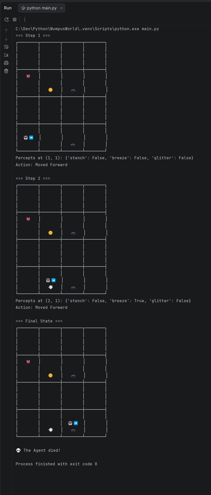

# Wumpus World AI

A Python implementation of the classic Wumpus World environment from
*Artificial Intelligence: A Modern Approach* by Russell and Norvig.

The project explores how an agent can use its surroundings and stored
knowledge to navigate a grid, avoid hazards, and find the gold. It is being
developed incrementally, with the current work tracked in GitHub Issues.

## Getting Started

### Prerequisites

- Python 3.8 or newer

The current prototype uses only Python standard-library modules, so no package
installation is required.

### Running the Simulation

From the repository root, run:

```bash
python scripts/main.py
```

The simulation renders the board, prints the current percepts, and advances
the agent through the demonstration loop.

Optional command-line settings:

```bash
python scripts/main.py --delay 0.25 --grid-size 6
```

`--delay` controls the pause between steps, and `--grid-size` sets the board
width and height. The default values are 1 second and a 4x4 board.

The renderer uses box-drawing characters and emojis when the terminal supports
UTF-8. On terminals with limited encoding support, it automatically falls back
to an ASCII board using letters and symbols such as `W` for Wumpus, `P` for
pit, and `G` for gold.

### Current Output



## Project Structure

| File | Responsibility |
| --- | --- |
| `scripts/main.py` | Starts and runs the current demonstration simulation. |
| `scripts/testmain.py` | Renders a custom board layout for manual inspection. |
| `scripts/randommain.py` | Renders a seeded randomized board for manual inspection. |
| `scripts/environment.py` | Defines the board, hazards, percepts, and movement. |
| `scripts/agent_state.py` | Stores the agent's position, direction, and status. |
| `scripts/direction.py` | Defines the four directions and turn calculations. |
| `scripts/renderer.py` | Draws the board and discovered percepts in the terminal. |
| `scripts/kb.py` | Provides the knowledge-base foundation for agent reasoning. |
| `scripts/agent.py` | Provides the knowledge-based agent foundation. |

## Testing

Automated tests are being developed as part of the project. For now, run the
simulation as a manual smoke test:

```bash
python scripts/main.py
```

The issue tracker contains the current development tasks and project roadmap.

Custom layouts can be created in Python by passing positions to the
environment:

```python
environment = WumpusEnvironment(
    grid_size=5,
    wumpus_pos=(5, 5),
    pits={(1, 4), (2, 2), (3, 3), (4, 4), (5, 1)},
    gold_pos=(3, 5),
)
```

To render the example custom layout without running the simulation or test
suite, run:

```bash
python scripts/testmain.py
```

Randomized layouts can be rendered with a repeatable seed:

```bash
python scripts/randommain.py
```

## Contributing

Contributions are welcome. Start by opening or selecting an issue, then create
a branch for the work and open a pull request when it is ready. Pull requests
to `master` require review before they can be merged.

Please keep changes focused, describe what changed in the pull request, and
include testing details when applicable. The repository's issue tracker is the
best place to discuss ideas and find work to contribute.
